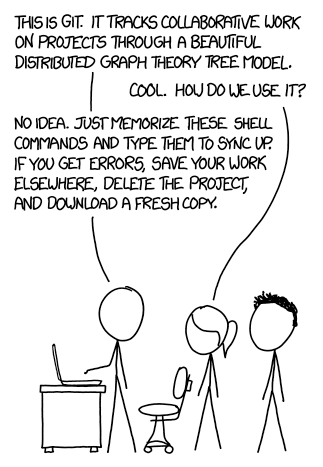
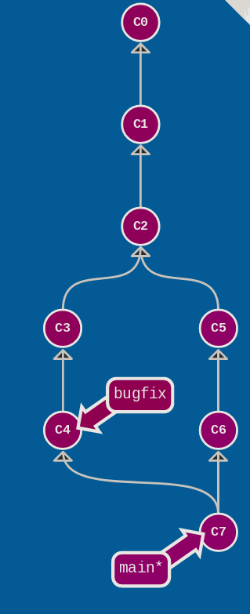

# What is git

- Git is a “Control Version System” (CVS),
- To take track of modifications on text files (source code but non only),
- Can be used locally (as an archive) or with a remote server, like Gihhub, Gitlab, Gitea for collaboration.
- Many development tools are now linked with git 


---

# How does git works?

- Git stores the differences between to version of the same file (when it’s possible)
- The history is never deleted (beware when uploading big files)
- You can work on several version of the same file using branches

### Train with git

https://learngitbranching.js.org
 


---

# Some git vocabulary (1)

**repository**: a folder containing the files that are tracked by the git system

**commit**: the basic operation in git to validate modifications to the code.  A commit is a version of the content of the repository. In practice, it contains the difference with respect to the previous commit.

**log**: list of all the commit so far. 

**commit hash**: the unique identifier of a commit. It can be found in the log.
Eg. c82a22c39cbc32576f64f5c6b3f24b99ea8149c7 (you can shorten it as long as it stays unique).


--- 

# Some git vocabulary (2)


**work copy**: the status of the file in the repository. Some files may have uncommitted changes or not even be tracked by git.

**staged files**: the files and changes that will be included in the next commit. Files can be added to that list thanks to the command git add.

**branch**: git can track several version of the content of a repository, called branches 

**local & remote repository**: change are usually done on a local version of the repository, and are then synchronised with a remote copy of it (on Github, Gitlab, Gitea, or other) to allow collaboration. 

---


# Let's try it now with a example!

1. Clone the test repository: ``git clone git@github.com:nbrucy/git_tuto.git``

2. Check the working copy ``ls -l``

3. Check the status  `git status` 
   ℹ️ Some tools like `gitg` allows to do it with a graphic interface.
   
4. Check previous commit `git log` 
   
5. Do a modification (see next slide)

---

# Basic git workflow

1. `git clone` or  `git init` → only once : create a repository
2. `git pull` → *fetch* new *commits* from the *remote repository* and *merge* them with the local version
3.  Modify file.example 
4. `git add file.example`
5. `git commit -m “Changed the example”` →  Validate the changes. Commit messages are important to keep track of what modifications where made
6. `git status` → Check if the repository status is as expected
7. `git push` → Upload the modifications to the remote repository

--- 


# Deal with conflicts (1)

Conflict are common when working simultaneously on the the file. Don't be afraid of them. 

1. Get the list of conflicted files
```
$ git status
   On branch main
Your branch is ahead of 'origin/main' by 1 commit.
  (use "git push" to publish your local commits)

You have unmerged paths.
  (fix conflicts and run "git commit")
  (use "git merge --abort" to abort the merge)

Unmerged paths:
  (use "git add <file>..." to mark resolution)
        both modified:   git.md

no changes added to commit (use "git add" or "git commit -a")
```

---

# Deal with conflicts (2)

2. Open the files and look for pattern like this. Choose the version you want to keep.

```
\<<<<<<< HEAD
When collaborating, merging is better done
||||||| 9949f0c
In a colloborative environnement, merging is better done 
=======
In a collaborative environnement, merging is better done
>>>>>>> test
```
3. Stage the merged file `git add git.md`
4. Commit `git commit -m "solved merge conflict"`


---

# Working with branches



Branch are useful to develop a new feature or bugfix in parallel

### The basic commands:

- `git checkout -b bugfix` Create a new branch and switch to it
- `git checkout main` Switch to another branch
- `git merge bugfix` Merge the branch `bugfix` into the main branch

### Merging branches

When collaborating, merging is better done using the *Merge request* or *Pull request* feature of Gitlab/Github

---

# Cancelling commits

:warning: It's rather hard to loose anything that was committed, but's it's rather easy to mess up things

- `git commit --amend` Update the last commit. 
    :warning: Do it only if the last commit was not pushed on the remote

- `git revert cf97549a` Revert a commit by adding a new commit that do the same modifications, but in reverse (can make the logfile harder to read). The original commit is not deleted.


- `git checkout cf97549a -b new_branch` Create a new branch back it time. 

- `git reset` , `git rebase` Powerful to rewrite git history but dangerous. Come back to it when you are more experienced.

--- 

# More useful commands


- `git add -u .` Only stage updated file in this folder and subfolder to be committed

- `git diff`  diff of what is changed but not staged
- `git diff --staged` diff of what is staged but not yet committed
- `git stash` Temporarily save unstaged changes (useful when merging with unfinished modifications)
- `git stash pop` Recover the saved modifications

---
# Check git history

 - `git log` Show all commits in the current branch’s history

- `git blame file` Look at who last modified each line of the file and for which commit.


- `git diff d0473176ecd` Check what was modified since the commit d0473176ecd

- `git diff ea9dd4eef 9949f0cfb` Check what was modified between the commit ea9dd4eef and 9949f0cfb


---

# Common mistakes & advices

- Avoid staging big binary file. Git cannot properly track their difference and store the full file for all versions.
It's rather difficult to delete them once their are in the history (but doable).

- Avoid automatically modifying all files (eg. automatic formatting). That may generates a lot of conflicts.

- Read the messages! Git is giving very useful information in status and error messages.

--- 


# Use modern git tools

- Git has plugins for most widely used IDE (vscode, emacs, vim eclipse, ...)
- Easy conflict solving, diff, blame, etc ...
- Use the forges! (GitHub, GitLab)

## Still to learn

- `pre-commit` hook: automatic check the syntax of whatever you commit
- Heavy history rewriting with `git rebase`
- Cherry-pick commit (to just take what you want from a branch)
- Using `.gitignore` to avoid pushing temporary files

---

# Useful links

## Intro tutorials

- 🇬🇧/🇫🇷 https://learngitbranching.js.org
- 🇬🇧 https://git-scm.com/docs/gittutorial
- 🇬🇧 https://www.w3schools.com/git/default.asp
- 🇫🇷 https://openclassrooms.com/fr/courses/7162856-gerez-du-code-avec-git-et-github 

## Command list
- https://git-scm.com/docs
- https://education.github.com/git-cheat-sheet-education.pdf


---

## Adding ssh key

- https://docs.github.com/en/authentication/connecting-to-github-with-ssh/adding-a-new-ssh-key-to-your-github-account

## Example of Gitignore files

- https://github.com/github/gitignore
